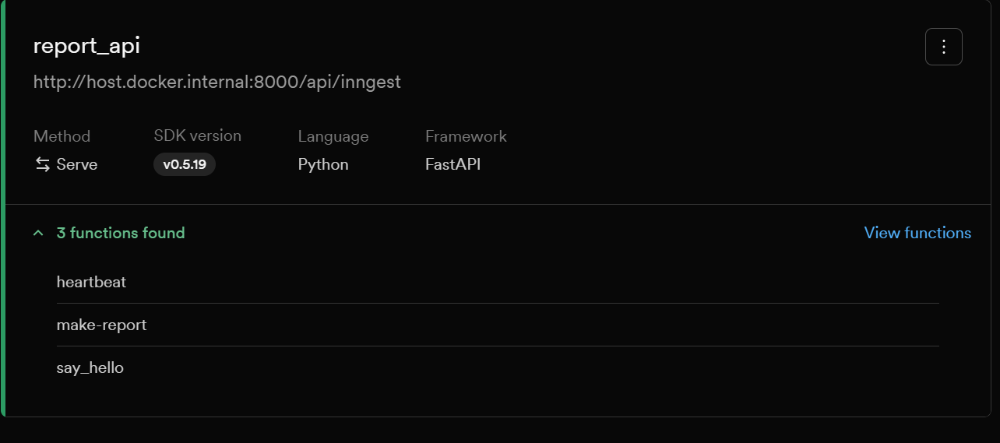

# Report API & Background Jobs (Inngest + FastAPI)

A robust, asynchronous report generation and background job scheduling system built with **FastAPI** and **Inngest**. This project demonstrates event-driven background processing, scheduled cron tasks, and state management using lightweight, file-based JSON storage.

---

## 🚀 How to Run the Project

To run this project, you need to spin up both the FastAPI application and the Inngest Dev Server.

### 1. Run the FastAPI Application
Set the environment variable `INNGEST_DEV=1` to enable local development, and start the Uvicorn server:

```bash
# Set environment variables
# On Windows (PowerShell):
$env:INNGEST_DEV=1

# On macOS/Linux:
export INNGEST_DEV=1

# Run the FastAPI server with auto-reload
uv run uvicorn app.main:app --reload
```
The FastAPI API will be available at `http://127.0.0.1:8000`.

### 2. Run the Inngest Dev Server
Start the Inngest Dev Server to orchestrate, trigger, and view background functions:

```bash
npx inngest-cli@latest dev -u http://127.0.0.1:8000/api/inngest
or
docker run -p 8288:8288 inngest/inngest inngest dev -u http://host.docker.internal:8000/api/inngest --no-discover
```
The Inngest Development Dashboard will be accessible at `http://127.0.0.1:8288`.

---

## 📋 API Endpoints & Background Functions

### HTTP Endpoints
| Method | Path | Description | Response Status |
| :--- | :--- | :--- | :--- |
| `GET` | `/health` | Health check endpoint for FastAPI application | `200 OK` |
| `POST` | `/reports` | Request a new asynchronous report; triggers the `report/requested` event | `202 Accepted` |
| `GET` | `/reports/{report_id}` | Retrieve the status and results of a report | `200 OK` / `404 Not Found` |
| `GET`/`POST` | `/api/inngest` | Inngest integration endpoint (handles serving functions to Inngest) | `200 OK` |

### Background Functions (Inngest)
| Function ID | Trigger | Retries | Description | Return Type |
| :--- | :--- | :--- | :--- | :--- |
| `say_hello` | Event: `app/health.check` | 2 | Sleeps for 5 seconds, logs event, and returns a greeting | `str` |
| `make-report` | Event: `report/requested` | Default | Asynchronously processes report details, sleeps for 8 seconds, updates database to `done`, and saves. If topic is `"fail"`, it throws an exception. | `dict[str, str]` |
| `heartbeat` | Cron: `TZ=UTC * * * * *` | Default | Periodically scans the `dictionary/` directory to aggregate report statuses (`Pending`, `Done`, `Fail`). | `dict[str, int]` |

---

## 📸 Inngest Dashboard Screenshot

Below is the screenshot of the registered functions in the local Inngest Developer Dashboard:



---

## 🧪 Proof of Execution (Request & Polling Logs)

Below is the live execution proof demonstrating a client requesting a report, receiving an immediate `202 Accepted` response, and polling the status endpoint until the asynchronous Inngest job completes.

### 1. Requesting the Asynchronous Report (`POST /reports`)
```bash
$ curl -i -X POST http://127.0.0.1:8000/reports \
    -H "Content-Type: application/json" \
    -d '{"topic": "Asynchronous Workflows"}'

HTTP/1.1 202 Accepted
date: Sat, 22 Aug 2026 12:00:00 GMT
server: uvicorn
content-length: 64
content-type: application/json

{"id":"9b1deb4d-3b7d-4bad-9bdd-2b0d7b3dcbfa","status":"pending"}
```

### 2. Immediate Poll (`GET /reports/{id}`)
*Polled immediately after creation. The Inngest step function is currently sleeping/processing.*
```bash
$ curl -i http://127.0.0.1:8000/reports/9b1deb4d-3b7d-4bad-9bdd-2b0d7b3dcbfa

HTTP/1.1 200 OK
date: Sat, 22 Aug 2026 12:00:01 GMT
server: uvicorn
content-length: 49
content-type: application/json

{"status":"pending","result":null}
```

### 3. Subsequent Poll After 8+ Seconds (`GET /reports/{id}`)
*Polled after 8 seconds. The Inngest function has completed successfully, updating the storage.*
```bash
$ curl -i http://127.0.0.1:8000/reports/9b1deb4d-3b7d-4bad-9bdd-2b0d7b3dcbfa

HTTP/1.1 200 OK
date: Sat, 22 Aug 2026 12:00:10 GMT
server: uvicorn
content-length: 73
content-type: application/json

{"status":"done","result":"Report on Asynchronous Workflows"}
```

---

## 🧠 Strategic Reflection & Concepts

### Stage 3: Cron Expressions
* **Daily Cron:** To execute this background function every single day at precisely 08:00 UTC, the cron expression `0 8 * * *` is used.
* **Weekly Sunday Cron:** To execute this background function every Sunday at precisely 22:00 UTC, the cron expression `0 22 * * 0` is used.

### Stage 4: Input Validation vs. Runtime Retry Philosophy
* **Philosophy Reflection:** A structurally incorrect or empty payload represents an invalid state that must be rejected immediately at the application entrypoint ("at the door") with a `400 Bad Request` to avoid wasted scheduling, whereas transient runtime errors (such as network timeouts or temporary resource unavailability) represent a "wrong moment" that is temporary, making them ideal candidates for Inngest's automated retries and backoff.
